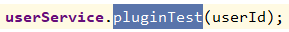

# idea-plugin
> 该插件的作用是通过窗口的输入来一次性产生service,serviceImpl,dao,mapper的相应方法，用鼠标选择xxxService.后面的方法名，然后摁快捷键”shift ctrl alt z“即可触发，然后根据交互窗口进行选择即可

**安装说明：** 选择plugin-1.0-SNAPSHOT.zip

**使用说明：**
1.  选择controller层中的service的方法

2.  光标选择方法

3.  摁住**shift ctrl alt z**即可触发窗口进行交互，先进行参数类型选择

4.  进行返回值类型选择

5.  进行注释编写

6.  进行mapper类型选择

7.  service层生成的代码

8.  serviceImpl层生成的代码

9.   dao层生成的代码

10.  mapper层生成的代码

**不过需要注意的是，匹配相应的层都是通过controller中的service的名字的前缀，如上图中的userService的前缀user来去匹配项目中的UserService,UserServiceImpl,UserDao.java,UserDao.mapper的，因此命名需按照这种规范才能找到相应的文件**